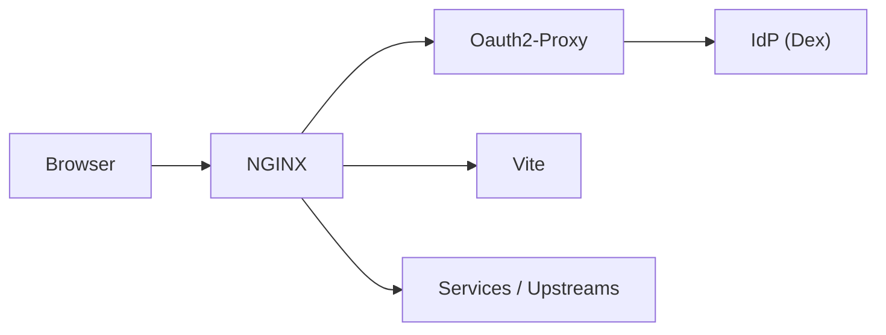

# Visage

Visage (`/vit·ɛdʒ/`) is a Vite plugin for local development with HMR and OIDC session cookie lifecycle semantics.

## Getting Started

Install Visage from npm:

```console
npm install @blakearoberts/visage@next
```

Add the plugin to `vite.config.ts`:

```ts
import { defineConfig } from 'vite';
import visage from '@blakearoberts/visage';

export default defineConfig({
  plugins: [visage()],
});
```

Then start Vite normally:

```console
vite
```

## Configuration

Visage is configured through `visage(options?)` in `vite.config.ts`.

The top-level `host` and `port` configure the local Visage origin that the browser visits:

```ts
visage({
  host: 'localhost',
  port: 9001,
});
```

Services are Docker Compose services managed by the Vite dev-server lifecycle. Upstreams are proxy targets that Visage routes to, whether they are managed services or external systems.

```ts
visage({
  services: {
    whoami: { image: 'traefik/whoami' },
  },
  upstreams: {
    whoami: {
      host: 'whoami',
      locations: { '/whoami/': {} },
    },
  },
});
```

See `VisageOptions` for the full option surface.

## Expected Local URLs

The browser-facing Visage origin is `https://{host}:{port}`.

With the default configuration, open:

```text
https://localhost:9001/
```

When using the managed Dex flow, OAuth2 Proxy serves auth endpoints under `/oauth2/` and Dex serves OIDC endpoints under `/dex/`.

## System Block Diagram



## Required Tools

- [Docker](https://docs.docker.com/get-started/get-docker/) with Compose v2 support through `docker compose`.

## Managed Tools

### mkcert

Visage downloads [`mkcert`](https://github.com/FiloSottile/mkcert) from `dl.filippo.io` into `$XDG_CACHE_HOME/visage/bin/mkcert-<platform>-<arch>` when the Vite dev server starts. Visage uses it to install a local certificate authority and generate HTTPS certificates for the local proxy.

### Docker Images

Visage pulls these as needed based on configuration:

| Service                                                      | Image                                                                                               | Source                    |
| ------------------------------------------------------------ | --------------------------------------------------------------------------------------------------- | ------------------------- |
| [NGINX](https://nginx.org/)                                  | [`nginx:1.30.0-alpine`](https://hub.docker.com/_/nginx)                                             | Docker Hub                |
| [OAuth2 Proxy](https://oauth2-proxy.github.io/oauth2-proxy/) | [`quay.io/oauth2-proxy/oauth2-proxy:v7.15.2`](https://quay.io/repository/oauth2-proxy/oauth2-proxy) | Quay                      |
| [Dex](https://dexidp.io/)                                    | [`ghcr.io/dexidp/dex:v2.45.1`](https://github.com/dexidp/dex/pkgs/container/dex)                    | GitHub Container Registry |

## Security Notes

Visage is local-development tooling. It starts local auth infrastructure, terminates local HTTPS, and forwards authenticated identity or token material to configured upstreams.

Do not treat the managed Dex and OAuth2 Proxy defaults as production auth infrastructure.

## Troubleshooting

- If startup fails immediately, confirm Docker is running and `docker compose` works.
- If NGINX cannot start, check whether the configured `port` is already in use.
- If the hostname cannot be resolved, Visage may need permission to update `/etc/hosts`.
- If the browser rejects the certificate, allow the local certificate authority prompt from `mkcert`.

## TO-DO

- [ ] Support configuring [Dex connectors](https://dexidp.io/docs/connectors/).
- [ ] Support configuring Dex on a distinct subdomain, such as `auth.localhost`.
- [ ] Support optional [HTTP mode without local TLS](docs/tls-http-mode.md).
