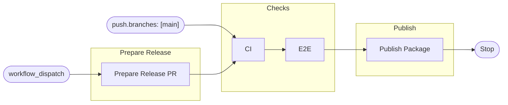

# Release Process

Releases are GitHub Actions-driven. The workflows are split by entrypoint:

- The reusable `Checks` workflow contains the shared CI and E2E jobs.
- The `CI` workflow runs the shared checks for pull requests and pushes to
  `main`.
- The `Publish` workflow runs after a successful `CI` workflow from a push to
  `main`; ordinary merges publish the next RC only to npm with the `next`
  dist-tag, while release merges publish to npm with the `latest` dist-tag and
  create the stable Git tag and GitHub Release.
- Manual `Prepare Release` workflow dispatch from `main` prepares a stable
  version bump pull request for manual review and merge.



## Release Candidates

Merging to `main` publishes an RC after CI passes, except for stable release
merge commits. See [Publish target resolution](#publish-target-resolution) for
the exact inputs, outputs, and target selection rules.

To start a non-patch release train after a stable release, make a normal pull
request that sets `packages/visage/package.json` and `package-lock.json` to a
prerelease seed for that train:

```sh
npm version 0.1.0-rc.0 --workspace @blakearoberts/visage --no-git-tag-version --ignore-scripts
```

When that PR merges and CI passes on `main`, the publish workflow publishes the
next RC for that seeded train.

The RC is published only to npm with the `next` dist-tag and provenance. The
workflow does not create a Git tag or GitHub Release for an RC.

## Stable Releases

Use the `Prepare Release` workflow's manual dispatch from the `main` branch.

The optional `version` input accepts a stable version such as `0.0.1` or
`v0.0.1`. If omitted, the workflow uses the current package version without its
prerelease suffix.

The prepare workflow:

1. Verifies the run is still on the latest `main`.
2. Verifies the release tag and npm package version do not already exist.
3. Updates `packages/visage/package.json` and `package-lock.json`.
4. Pushes a `release/v<version>` branch with the release automation app.
5. Opens or updates a `chore(release): v<version>` pull request into `main`.

The release pull request is the manual review point. It should use the
same-repository `release/v<version>` branch and only change
`packages/visage/package.json` and `package-lock.json`.

If the release pull request checks fail, the pull request remains open as the
failure artifact. No tag, npm package, npm dist-tag, or GitHub release is
created.

After the release pull request checks pass, merge it to `main` with a merge
commit. The `CI` workflow runs the shared checks on that merged `main` commit.
After those checks pass, the publish workflow uses
[Publish target resolution](#publish-target-resolution) to publish with the
`latest` dist-tag, then tags the merged `main` commit and creates the GitHub
release. The release body starts with a package section that links to the exact
npm package version, then includes GitHub-generated release notes from the
previous reachable `v*` tag, including merged pull request links and the compare
link.

The release pull request title is `chore(release): v<version>`, its commit
message matches that title, and its generated body describes the operational
release flow rather than acting as the changelog source.

The stable release success state is aligned across source and stable package
artifacts: the `main` merge commit, git tag, GitHub release, npm package
version, and npm `latest` dist-tag all identify the same stable version. The npm
`next` dist-tag is only moved by RC publishes and may remain on the latest RC
after a stable release.

## Publish Target Resolution

### Inputs Needed

- From branch for the merge commit, for example `release/v<version>`.
- To branch for the merge commit, expected to be `main`.
- Commit that passed CI.
- Repo checkout at that commit, used for package name and package version.
- Published npm versions for the package, used only to choose the next RC
  number.

### Outputs Needed

- Publish mode:
  - `none`
  - `rc`
  - `stable`
- Package version to publish.

### Steps To Resolve

- Read package name and package version from the checkout.
- If the merge is from `release/v<version>` to `main`, and the checkout package
  version is the same stable version, output `stable` and that package version.
- Otherwise resolve an RC target:
  - if the checkout package version is already a prerelease, use that
    prerelease's stable base.
  - if the checkout package version is stable, use the next patch version as the
    RC base.
  - calculate the next RC version for that base from the published npm versions,
    using the committed RC number as the floor when the checkout is already an
    RC.
  - output `rc` and that RC version.

## Requirements

- Dispatch stable releases from the `main` branch.
- The release version must not include a prerelease suffix.
- npm trusted publishing must trust `.github/workflows/publish.yml` for
  `@blakearoberts/visage`.
- The release automation app configured by `AUTO_MERGE_APP_CLIENT_ID` and
  `AUTO_MERGE_APP_PRIVATE_KEY` must have contents and pull request write access
  so the Prepare Release workflow can open the version bump PR.
- Only `blakearoberts` may dispatch stable releases.
- The `main` branch ruleset must allow merge commits because stable release pull
  requests should be merged that way.
- Release PR metadata must satisfy
  [Publish Target Resolution](#publish-target-resolution).
- Release pull requests must use a same-repository `release/v<version>` head
  branch and only change `packages/visage/package.json` and `package-lock.json`
  to match the release workflow's expected version-bump boundary.
- The repository has a `v* release tags` ruleset for `refs/tags/v*` that blocks
  creation, updates, and deletion except by the release automation app.
