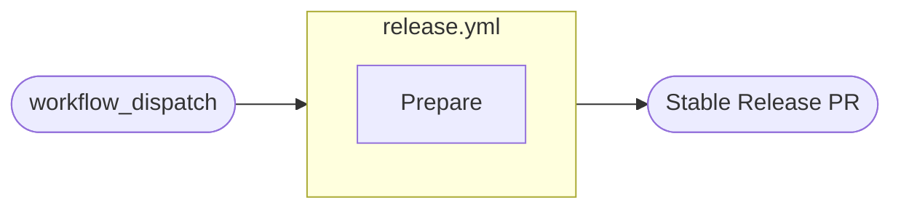
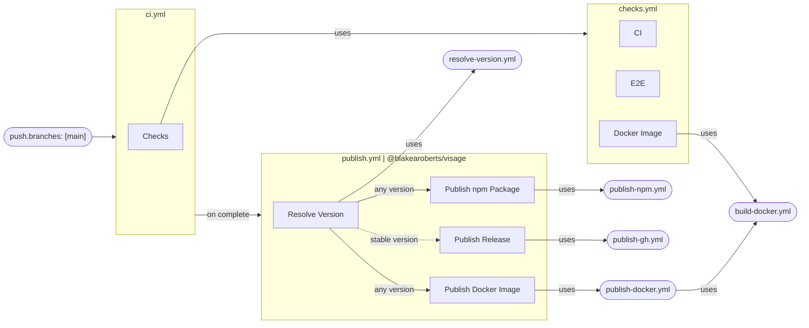

# Release Process

Releases are GitHub Actions-driven:

- The `CI` workflow runs the shared checks for pushes to `main` which is allowed
  only by merge of a PR with passing checks.
- The `Publish` workflow runs after a successful `CI` workflow; ordinary merges
  publish an RC to npm and the Visage NGINX image with their respective `next`
  tags, while stable release PR merges publish to npm with the `latest`
  dist-tag, publish versioned and `latest` Visage NGINX image tags to GitHub
  Container Registry, and create the stable Git tag and GitHub Release.
- Manual `Release` workflow dispatch from `main` prepares a stable release pull
  request.


```mermaid
flowchart LR
  subgraph release_yml[release.yml]
    Prepare
  end
  stable_start([workflow_dispatch]) --> release_yml
  release_yml --> stable_pr([Stable Release PR])
```


```mermaid
flowchart LR
  subgraph ci_yml[ci.yml]
    ci_checks[Checks]
  end
  subgraph checks_yml[checks.yml]
    CI
    E2E
    docker_check[Docker Image]
  end
  subgraph publish_yml["publish.yml | @blakearoberts/visage"]
    resolve_version_job[Resolve Version]
    pub_npm_job[Publish npm Package]
    pub_docker_job[Publish Docker Image]
    pub_gh_job[Publish Release]
    resolve_version_job -->|any version| pub_npm_job
    resolve_version_job -->|any version| pub_docker_job
    resolve_version_job -.->|stable version| pub_gh_job
  end
  pr_merge(["push.branches: [main]"]) --> ci_yml
  ci_checks -->|uses| checks_yml
  ci_yml -->|"on complete"| publish_yml
  docker_check -->|uses| build_docker_yml([build-docker.yml])
  resolve_version_job -->|uses| resolve_version_yml([resolve-version.yml])
  pub_npm_job -->|uses| pub_npm_yml([publish-npm.yml])
  pub_docker_job -->|uses| pub_docker_yml([publish-docker.yml])
  pub_docker_yml -->|uses| build_docker_yml
  pub_gh_job -->|uses| pub_gh_yml([publish-gh.yml])
```

## Release Candidates

Merging to `main` publishes an RC after CI passes, except for stable release
merge commits.

To start a non-patch release train after a stable release, make a normal pull
request that sets `packages/visage/package.json` and `package-lock.json` to a
prerelease seed for that train:

```sh
npm version 0.1.0-rc.0 --workspace @blakearoberts/visage --no-git-tag-version --ignore-scripts
```

When that PR merges and CI passes on `main`, the publish workflow publishes the
next RC for that seeded train.

The RC is published to npm with the `next` dist-tag and provenance. The Visage
NGINX image is published only with the mutable `next` tag. The workflow does not
create a versioned container tag, Git tag, or GitHub Release for an RC. After
every image publish, untagged manifests that are not referenced by a retained
multi-platform image are deleted.

## Stable Releases

Use the `Release` workflow's manual dispatch from the `main` branch.

The optional `version` input accepts a stable version such as `0.0.1` or
`v0.0.1`. If omitted, the workflow uses the current package version without its
prerelease suffix.

The prepare workflow:

1. Verifies the run is still on the latest `main`.
2. Verifies the release tag and npm package version do not already exist.
3. Updates `packages/visage/package.json` and `package-lock.json`.
4. Pushes a `release/visage/v<version>` branch with the release automation app.
5. Opens or updates a `chore(release): v<version>` pull request into `main`.

The release pull request is the manual review point. It should use the
same-repository `release/visage/v<version>` branch and only change
`packages/visage/package.json` and `package-lock.json`.

If the release pull request checks fail, the pull request remains open as the
failure artifact. No tag, npm package, npm dist-tag, or GitHub release is
created, and no container image is published.

After the release pull request checks pass, merge it to `main` with a merge
commit. The `CI` workflow runs the shared checks on that merged `main` commit.
After those checks pass, the publish workflow independently publishes with the
`latest` dist-tag, publishes `ghcr.io/blakearoberts/visage-nginx:<version>` for
AMD64 and ARM64, updates the image's `latest` tag, tags the merged `main`
commit, and creates the GitHub release. The release body starts with a package
section that links to the exact npm package version, then includes
GitHub-generated release notes from the previous reachable `v*` tag, including
merged pull request links and the compare link.

The release pull request title is `chore(release): v<version>`, its commit
message matches that title, and its generated body describes the operational
release flow rather than acting as the changelog source.

The stable release success state is aligned across source and stable package
artifacts: the `main` merge commit, git tag, GitHub release, npm package
version, npm `latest` dist-tag, versioned NGINX image, and NGINX image `latest`
tag all identify the same stable version. The npm and Visage NGINX image `next`
tags are only moved by RC publishes and may remain on the latest RC after a
stable release.

## Requirements

- Dispatch stable releases from the `main` branch.
- The release version must not include a prerelease suffix.
- npm trusted publishing must trust `.github/workflows/publish.yml` for
  `@blakearoberts/visage`.
- The release automation app configured by `AUTO_MERGE_APP_CLIENT_ID` and
  `AUTO_MERGE_APP_PRIVATE_KEY` must have contents and pull request write access
  so the `Release` workflow can open the version bump PR.
- Only `blakearoberts` may dispatch stable releases.
- The `main` branch ruleset must allow merge commits because stable release pull
  requests should be merged that way.
- Release pull requests must use a same-repository `release/visage/v<version>`
  head branch and only change `packages/visage/package.json` and
  `package-lock.json` to match the release workflow's expected version-bump
  boundary.
- The repository has a `v* release tags` ruleset for `refs/tags/v*` that blocks
  creation, updates, and deletion except by the release automation app.
