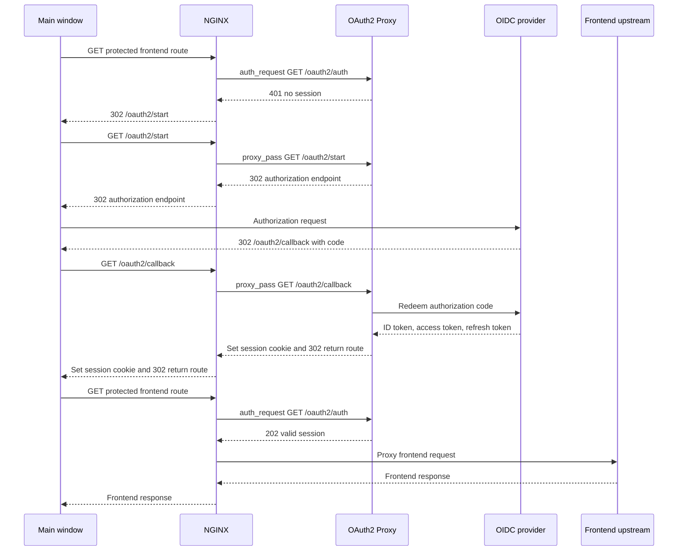
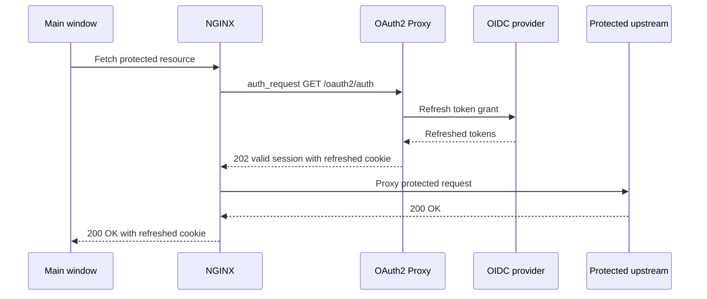
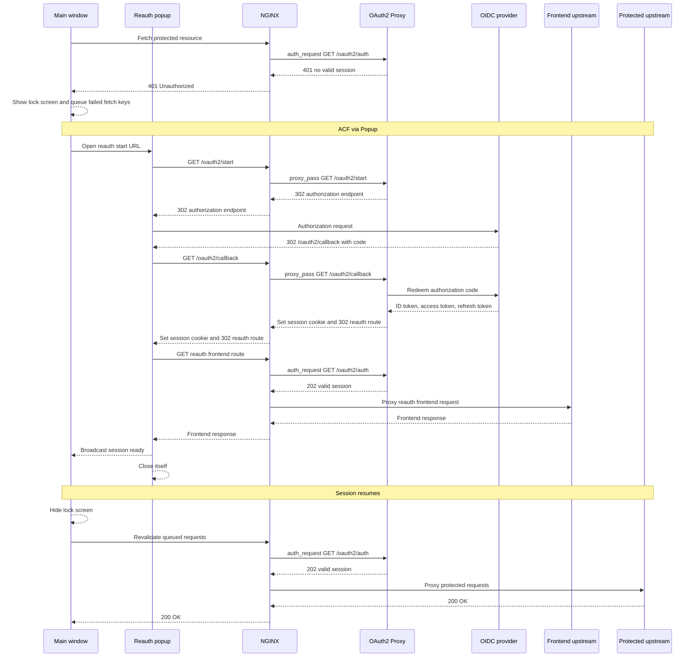

# Session Lifecycle

## Authorization Code Flow (ACF)

```mermaid
sequenceDiagram
  participant Main as Main window
  participant NGINX
  participant Proxy as OAuth2 Proxy
  participant IdP as OIDC provider
  participant Frontend as Frontend upstream

  Main->>NGINX: GET protected frontend route
  NGINX->>Proxy: auth_request GET /oauth2/auth
  Proxy-->>NGINX: 401 no session
  NGINX-->>Main: 302 /oauth2/start
  Main->>NGINX: GET /oauth2/start
  NGINX->>Proxy: proxy_pass GET /oauth2/start
  Proxy-->>NGINX: 302 authorization endpoint
  NGINX-->>Main: 302 authorization endpoint
  Main->>IdP: Authorization request
  IdP-->>Main: 302 /oauth2/callback with code
  Main->>NGINX: GET /oauth2/callback
  NGINX->>Proxy: proxy_pass GET /oauth2/callback
  Proxy->>IdP: Redeem authorization code
  IdP-->>Proxy: ID token, access token, refresh token
  Proxy-->>NGINX: Set session cookie and 302 return route
  NGINX-->>Main: Set session cookie and 302 return route
  Main->>NGINX: GET protected frontend route
  NGINX->>Proxy: auth_request GET /oauth2/auth
  Proxy-->>NGINX: 202 valid session
  NGINX->>Frontend: Proxy frontend request
  Frontend-->>NGINX: Frontend response
  NGINX-->>Main: Frontend response
```

## Session Renewal via Refresh Token

```mermaid
sequenceDiagram
  participant Main as Main window
  participant NGINX
  participant Proxy as OAuth2 Proxy
  participant IdP as OIDC provider
  participant API as Protected upstream

  Main->>NGINX: Fetch protected resource
  NGINX->>Proxy: auth_request GET /oauth2/auth
  Proxy->>IdP: Refresh token grant
  IdP-->>Proxy: Refreshed tokens
  Proxy-->>NGINX: 202 valid session with refreshed cookie
  NGINX->>API: Proxy protected request
  API-->>NGINX: 200 OK
  NGINX-->>Main: 200 OK with refreshed cookie
```

## Reauthentication via ACF Popup

```mermaid
sequenceDiagram
  participant Main as Main window
  participant Popup as Reauth popup
  participant NGINX
  participant Proxy as OAuth2 Proxy
  participant IdP as OIDC provider
  participant Frontend as Frontend upstream
  participant API as Protected upstream

  Main->>NGINX: Fetch protected resource
  NGINX->>Proxy: auth_request GET /oauth2/auth
  Proxy-->>NGINX: 401 no valid session
  NGINX-->>Main: 401 Unauthorized
  Main-->>Main: Show lock screen and queue failed fetch keys

  Note over Main,API: ACF via Popup
  Main->>Popup: Open reauth start URL
  Popup->>NGINX: GET /oauth2/start
  NGINX->>Proxy: proxy_pass GET /oauth2/start
  Proxy-->>NGINX: 302 authorization endpoint
  NGINX-->>Popup: 302 authorization endpoint
  Popup->>IdP: Authorization request
  IdP-->>Popup: 302 /oauth2/callback with code
  Popup->>NGINX: GET /oauth2/callback
  NGINX->>Proxy: proxy_pass GET /oauth2/callback
  Proxy->>IdP: Redeem authorization code
  IdP-->>Proxy: ID token, access token, refresh token
  Proxy-->>NGINX: Set session cookie and 302 reauth route
  NGINX-->>Popup: Set session cookie and 302 reauth route
  Popup->>NGINX: GET reauth frontend route
  NGINX->>Proxy: auth_request GET /oauth2/auth
  Proxy-->>NGINX: 202 valid session
  NGINX->>Frontend: Proxy reauth frontend request
  Frontend-->>NGINX: Frontend response
  NGINX-->>Popup: Frontend response
  Popup-->>Main: Broadcast session ready
  Popup-->>Popup: Close itself

  Note over Main,API: Session resumes
  Main-->>Main: Hide lock screen
  Main->>NGINX: Revalidate queued requests
  NGINX->>Proxy: auth_request GET /oauth2/auth
  Proxy-->>NGINX: 202 valid session
  NGINX->>API: Proxy protected requests
  API-->>NGINX: 200 OK
  NGINX-->>Main: 200 OK
```
