# Session-Unlocked SWR Cache Example Design

This example should demonstrate encrypted client-side caching as a
session-lifecycle pattern for Visage-protected apps.

The example is not a claim that browser storage can be made fully secure. It is
a demonstration that an authenticated session can unlock an encrypted cache for
fast first render while keeping durable client storage unusable after the
session is gone.

## Concept

SWR remains the source of network truth.

The encrypted cache is a first-render accelerator:

- On an authenticated document response, the browser receives ephemeral cache
  unlock material.
- On boot, the app can attempt to unlock cached SWR data without an extra
  network round trip.
- If the cache unlocks, SWR can render cached data immediately.
- SWR still revalidates with the backend.
- Fresh responses refresh the encrypted cache under the current session cache
  key.
- When the session is locked, expired, or signed out, unlock material is cleared
  and the persisted cache becomes unreadable.

## Demonstration Goal

Show how Visage's local session semantics can support a production-like
encrypted browser cache:

- cookie-backed session state at the edge
- authenticated initial page load
- session expiry and reauthentication behavior
- no extra unlock request after the initial authenticated response
- encrypted durable storage that is useful only while a session key is live

## Non-Goals

- Defend against active-session XSS.
- Defend against malicious browser extensions, malware, or compromised app
  JavaScript.
- Replace server-side authorization.
- Provide offline authorization.
- Define production key management infrastructure.
- Demonstrate service-worker fetch interception.
- Demonstrate a full offline-first sync protocol.

## Performance Model

The performance point is simple: the user should not wait for an API round trip
before seeing data that was already cached locally.

The numbers below are illustrative, not prescriptive.

```mermaid
gantt
  title First Useful Data Timing
  dateFormat X
  axisFormat %s ms

  section Network-only
  Authenticated document response :0, 100
  JavaScript boot                 :100, 250
  API fetch                       :250, 650
  First data render               :milestone, 650, 0

  section Session-unlocked cache
  Authenticated document + key    :0, 100
  JavaScript boot                 :100, 250
  Local cache decrypt             :250, 275
  First data render               :milestone, 275, 0
  Background revalidation         :275, 675
```

## Security Model

The cache key is a data-unlock key, not an authentication credential.

Compromise of a cache key should expose only the encrypted local cache for the
same user and cache scope. It must not grant API access.

Key rotation uses a small keyring:

- The current key is used for new writes.
- The previous key is read-only.
- Records encrypted with the previous key are migrated opportunistically.
- Old keys stop being delivered after their read window ends.
- Cache records that cannot be unlocked are treated as misses.

```mermaid
gantt
  title Current and Previous Cache Key Windows
  dateFormat X
  axisFormat Day %s

  section K1
  Current write key :0, 15
  Previous read key :15, 30

  section K2
  Current write key :15, 30
  Previous read key :30, 45

  section K3
  Current write key :30, 45
  Previous read key :45, 60
```

If a key is sent as both current and previous across adjacent windows, the total
delivery period is the sum of both windows. A 15-day write window plus a 15-day
read window means a key may be delivered for up to 30 days.

## Functional Requirements

- The example must render useful cached SWR data before network revalidation
  when a valid session-unlock key is available.
- The example must treat the backend response as authoritative after
  revalidation.
- The example must work without an unlock fetch after the initial authenticated
  document response.
- The example must leave encrypted cache bytes persisted after logout while
  clearing live unlock material.
- The example must treat missing, expired, or unknown-key cache records as cache
  misses.
- The example must support current-key writes and previous-key reads.
- The example must demonstrate cache lock and unlock behavior across
  reauthentication.
- The example README must describe its threat model so the cache is not mistaken
  for protection against active compromise.

## Non-Functional Requirements

- First useful data should be bounded by local storage and decryption latency,
  not API latency, when cache data is available.
- Cache unlock must add no network request beyond the authenticated document
  response.
- Cache migration must be opportunistic and interruptible.
- Cache migration must not block first render.
- Cache size, record age, and key age must be bounded.
- Cached data should be minimized to the bytes needed for the demonstrated user
  experience.
- Unlock material should be short-lived in browser-visible storage.
- Unlock material should be cleared on logout, session lock, and session
  failure.
- The example should degrade to normal SWR behavior when local encrypted caching
  is unavailable.

## Demonstrated User Experience

1. First login has no cache and behaves like normal SWR.
2. A later reload renders cached data quickly.
3. Revalidation updates the displayed data and refreshes the encrypted cache.
4. Session lock clears live unlock material.
5. Reload while locked cannot read the persisted cache.
6. Reauthentication unlocks the cache again if the keyring still covers the
   cached records.

## Open Design Choices

- Whether the unlock key is scoped per user, per device, per app, or per cache
  class.
- Whether cache expiration is shorter than, equal to, or independent from the
  key rotation window.
- Whether previous-key migration happens only after successful revalidation or
  also on local cache reads.
- Whether logout deletes encrypted cache bytes or only clears unlock material.
- Whether the example should show one cache class or several cache classes with
  different retention policies.
