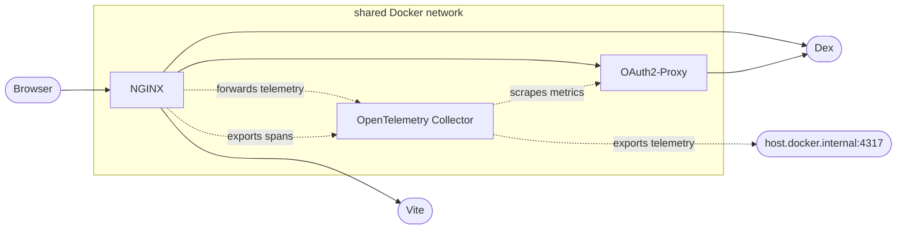

# Telemetry

Visage provides opt-in telemetry collection for its managed NGINX and OAuth2
Proxy services. Set `telemetry: {}` to run the managed OpenTelemetry Collector.

See the [telemetry example](../examples/telemetry) for how to configure Grafana
as a managed Visage service.

## Traces

When telemetry is enabled, Visage configures NGINX to export spans to the
OpenTelemetry Collector. The NGINX spans are configured with the following
resource attributes:

- `service.name=nginx`
- `service.namespace` set to the NPM package name
- `service.instance.id=${HOSTNAME}` (Docker container ID)
- `service.version=${NGINX_VERSION}`

## Metrics

When telemetry is enabled, Visage configures:

- OAuth2 Proxy to serve Prometheus metrics at `127.0.0.1:4181` which the
  OpenTelemetry Collector scrapes and exports.
- The Collector scrapes OAuth2 Proxy's Prometheus metrics.
- The Collector converts NGINX spans to explicit bucket histograms.

## Logs

Current state:

- Compose lifecycle output is written to `logs/compose.log`; joined container
  output is followed into `logs/container.log`.
- Plugin mode places these under `<Vite cacheDir>/visage`, while server mode
  uses `<cwd>/.visage`.
- NGINX access logs and OAuth2 Proxy request logs use hard-coded, aligned
  formats for skimming the joined file.
- Request URLs are persisted without redacting sensitive query values such as
  OIDC authorization codes. Logs are not exported through OpenTelemetry.

Desired state:

- Log location, format, and collection are explicit and consistent across plugin
  and server modes.
- Sensitive values are redacted before persistence, with structured,
  collector-friendly output available for application-owned pipelines.
- Visage supports exporting container logs of Visage managed services.
