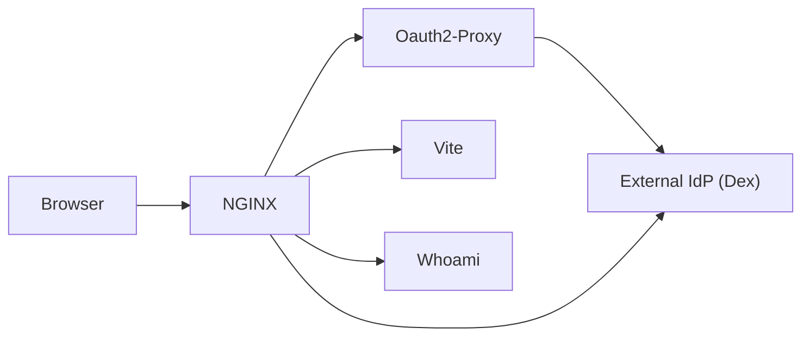

# External IdP Example

This example configures Visage to use an external OIDC IdP through an upstream
named `idp`. Dex is used only as the external IdP implementation for the
example.

```mermaid
flowchart LR
  Browser
  NGINX
  Oauth2-Proxy
  Vite
  IdP["External IdP (Dex)"]
  Whoami

  Browser --> NGINX
  NGINX --> Oauth2-Proxy
  Oauth2-Proxy --> IdP
  NGINX --> Vite
  NGINX --> Whoami
  NGINX --> IdP
```
