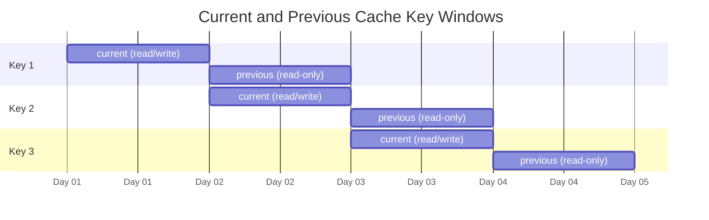
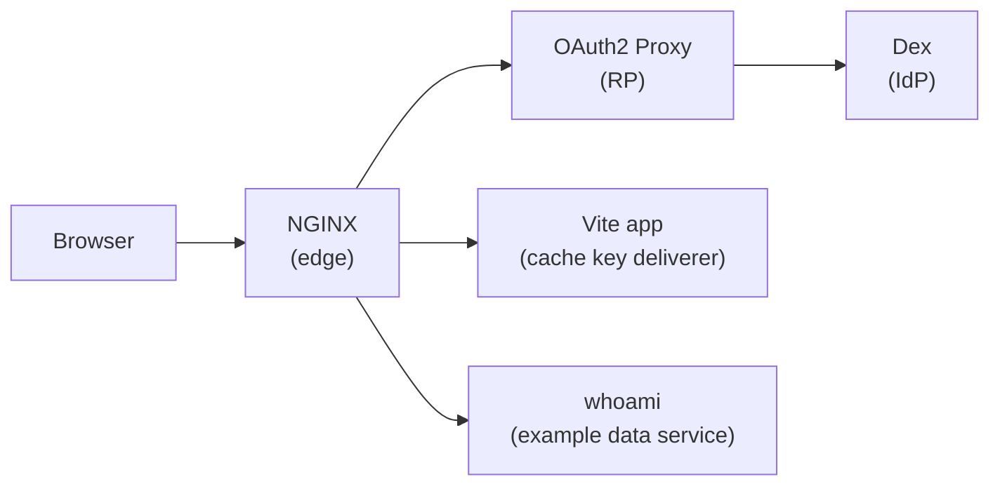
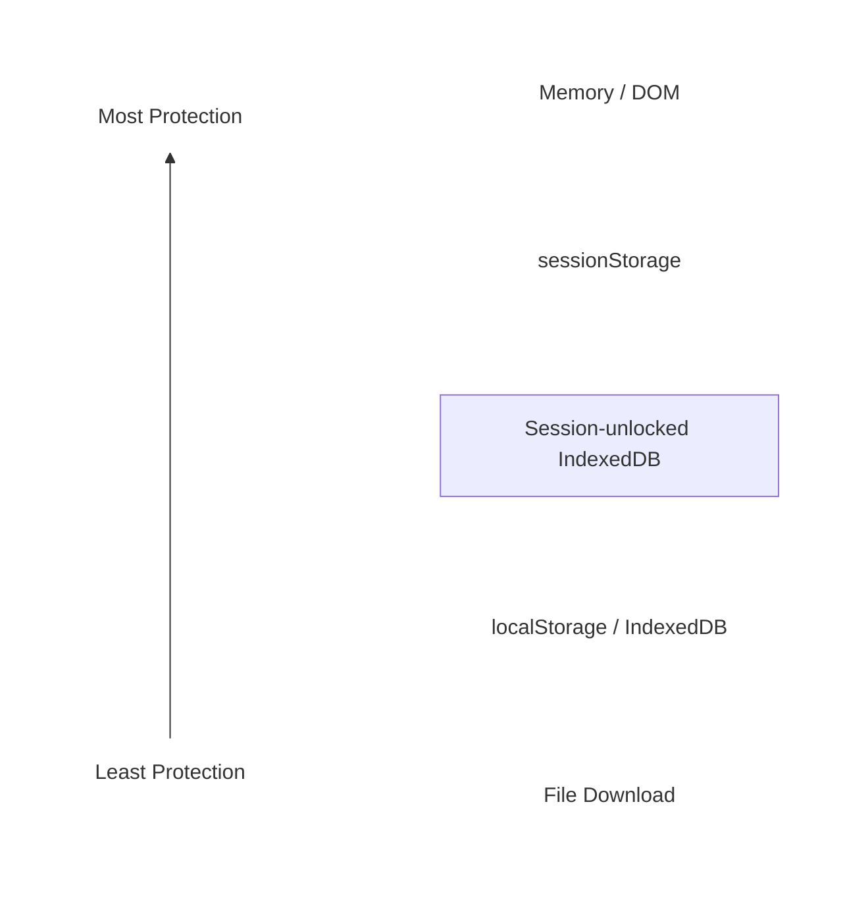

# Session-Unlocked SWR Cache Example

This example demonstrates zero-round-trip key material delivery for
session-unlocked IndexedDB cache encryption of SWR responses.

## Run

```console
npm install
npm run dev
```

Open `https://localhost:9004`.

The default username and password are `user@example.com` and `pass`.

## What It Shows

- The authenticated document response delivers a short-lived, host-only,
  JavaScript-readable cache keyring cookie.
- The cache layer imports the keyring into
  [Web Crypto](https://developer.mozilla.org/en-US/docs/Web/API/Web_Crypto_API)
  and clears the one-shot cookie.
- IndexedDB stores encrypted SWR records keyed by SWR cache key.
- SWR can render a local encrypted cache hit before network revalidation.
- SWR memory is cleared and the cache is locked on sign-out and `401` status
  responses.
- The app server keeps per-user cache keys and rotates them when delivering
  keyring cookies.
- A current key writes new records while a previous key can read old records.

## Cache Model

SWR remains the source of network truth. The encrypted IndexedDB cache is a
first-render accelerator: on boot, the app races normal network revalidation
against local cache decryption so cached data can render before the API response
returns.

Fresh backend responses remain authoritative and refresh the encrypted cache
under the current session cache key. The cache unlock adds no request beyond the
authenticated document response. When the session is locked, expired, or signed
out, live unlock material is cleared and persisted encrypted records become
unreadable until a later authenticated keyring covers them again.

Missing, expired, or unknown-key cache records are treated as cache misses, so
the example degrades to normal SWR behavior when local encrypted caching cannot
be used.

The timing numbers below are illustrative, not prescriptive.

```mermaid
gantt
  title First Useful Data Timing
  dateFormat x
  axisFormat %L ms

  section Network-only
  Document response : 0,   100
  JS boot           : 100, 150
  API fetch         : 150, 350
  First data render : milestone, 350

  section Session-unlocked cache
  Document response with key : 0,   100
  JS boot                    : 100, 150
  Local cache decrypt        : 150, 200
  First data render          : milestone, 200
  Background revalidation    : 150, 350
```



## Key Rotation

The example uses a small keyring:

- The current key writes new records.
- The previous key is read-only and can decrypt old records.
- Records decrypted with the previous key are migrated opportunistically to the
  current key.
- Old keys stop being delivered after their read window ends.

The following chart demonstrates daily key rotation which results in the same
key being delivered for up to two days.



If a key is delivered as both current and previous across adjacent windows, its
total delivery period is the sum of both windows. The example rotates on a short
cadence for demonstration purposes; production rotation and retention windows
are policy decisions.

## System Block Diagram



## Security Posture

Session-unlocked encrypted IndexDB storage does not inherently improve the
security of web applications. Caching sensitive data to any medium increases the
risk of data extraction. Caching to disk further increases this risk. Data
encryption helps mitigate this risk; however, not caching to disk is always
safer.

1. During active-session compromise, all browser-resident data is exposed to
   extraction regardless of medium or encryption.
1. During post-session disk inspection, encryption is materially better than
   plaintext IndexedDB or `localStorage`; however, compared to DOM or memory
   storage, caching to disk _**adds** durable ciphertext and metadata **risk**_.



IndexedDB cache encryption reduces data exposure:

- when processing exceptionally large or multi-part responses,
- after sign-out or session expiration,
- on shared-devices

However, overall security posture regresses compared to memory-only caching:

- Encrypted records still persist on disk.
- Cache keys, key IDs, and ciphertext sizes are durable, exposed metadata.
- Key material is (briefly) available to JavaScript while the page unlocks.
- Cached records outlive the page until key rotation elapses.

Note: the cache key is not an authentication credential. Stealing it should only
unlock the matching user's local encrypted cache scope.

## Non-Goals

This example does not:

- Defend against active-session XSS.
- Defend against malicious browser extensions, malware, or compromised app
  JavaScript.
- Replace server-side authorization.
- Provide offline authorization.
- Define production key management infrastructure.
- Demonstrate service-worker fetch interception.
- Demonstrate a full offline-first sync protocol.

## Unimplemented Additional Hardening Opportunities

The following list contains reasonable enhancements to the security posture of
session-unlocked encrypted caching.

- Hash cache keys prior to storage to minimize durable metadata.
- Split unlock material between the cookie and the HTML document. This narrows
  passive cookie/header/log exposure because the cookie value alone cannot
  decrypt records.
- Bind ciphertext with AES-GCM additional data such as user scope, page scope,
  cache key, and key id. This prevents ciphertext from being replayed under a
  different logical cache record.
- Issue per-page cache keys. This can materially reduce the blast radius of some
  active-session compromises. However, it requires key delivery to occur only on
  browser originated document navigations which can erode the user experience
  benefits of single-page applications.
- Pad records into size buckets to reduce size metadata leakage when data length
  is sensitive. This increases storage and does not protect against
  active-session compromise.
