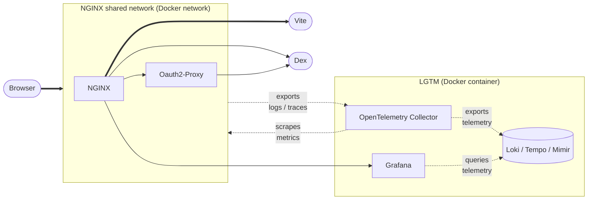
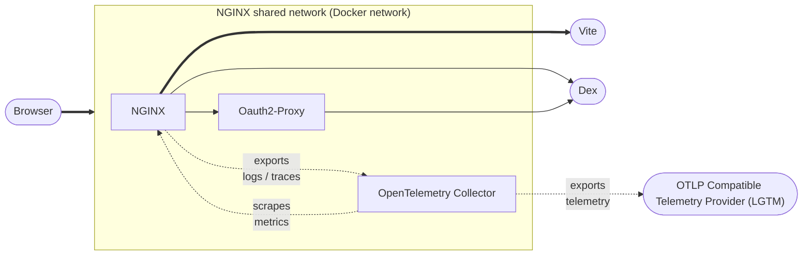

# Telemetry Example

This example demonstrates how to configure a full stack telemetry pipeline with
an authenticated Grafana frontend, and protected OTLP HTTP JSON export endpoints
for browser telemetry signals. Visage acts as the relying party between the
browser user-agent and the IdP, Dex. Visage forwards identity headers to
Grafana; Grafana is configured to trust the headers as user identity for
authorization.

## System Block Diagram

## Next Steps (TO-DO)

Visage supports out-of-the-box configuration to enable reporting and forwarding
of internal telemetry signals, and configuration of protected OTLP HTTP JSON
export endpoints for browser session integration.

