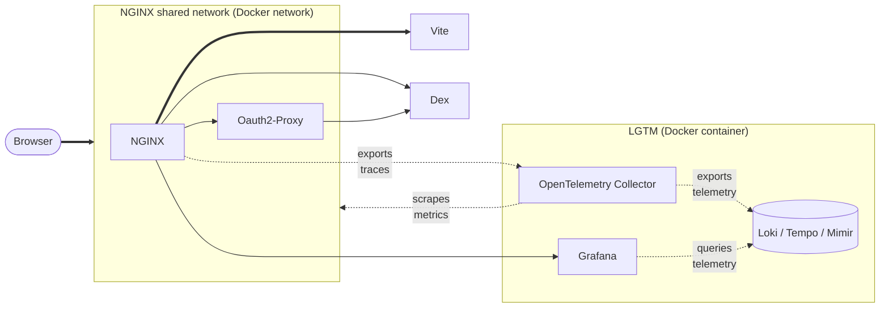

# Telemetry Example

## System Block Diagram

```mermaid
flowchart LR
  subgraph network["NGINX shared network (Docker network)"]
    NGINX --> Oauth2-Proxy
  end

  browser([Browser]) ==> network
  NGINX ===> Vite
  NGINX --> Dex
  Oauth2-Proxy --> Dex

  subgraph "LGTM (Docker container)"
    storage[(Loki / Tempo / Mimir)]
    otelcol[OpenTelemetry Collector]
    otelcol -.->|exports</br>telemetry| storage
    Grafana -.->|queries</br>telemetry| storage
  end

  NGINX --> Grafana
  NGINX -.->|exports</br>traces| otelcol
  otelcol -...->|scrapes</br>metrics| network
```
