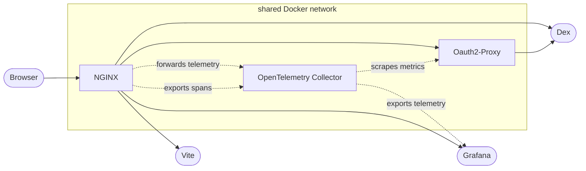

# Telemetry Example

This example enables Visage's managed OpenTelemetry Collector.

The Collector:

- receives NGINX traces and protected OTLP HTTP JSON browser logs;
- scrapes OAuth2 Proxy metrics;
- derives request metrics from NGINX spans;
- and exports each signal over OTLP to LGTM.

Visage acts as the relying party between the browser user-agent and the IdP,
Dex. Visage forwards identity headers to Grafana; Grafana is configured to trust
the headers as user identity for authorization.

## System Block Diagram

```mermaid
flowchart LR
  subgraph network["shared Docker network"]
    NGINX --> Oauth2-Proxy
    NGINX -..->|forwards telemetry| otelcol
    NGINX -..->|exports spans| otelcol
    otelcol -.->|scrapes metrics| Oauth2-Proxy
  end
  browser([Browser]) --> NGINX

  otelcol[OpenTelemetry Collector] -.->|exports telemetry| grafana

  NGINX --> vite([Vite])
  NGINX --> grafana([Grafana])
  NGINX --> idp([Dex])
  Oauth2-Proxy --> idp
```
