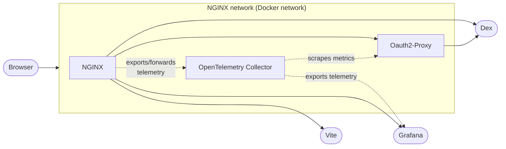

# Telemetry Example

This example demonstrates how to configure a standalone OpenTelemetry Collector
as a Visage-managed service. The Collector receives NGINX traces and protected
OTLP HTTP JSON browser logs, scrapes OAuth2 Proxy metrics, derives request
metrics from NGINX spans, and exports each signal over OTLP to LGTM. Visage acts
as the relying party between the browser user-agent and the IdP, Dex. Visage
forwards identity headers to Grafana; Grafana is configured to trust the headers
as user identity for authorization.

## System Block Diagram

```mermaid
flowchart LR
  subgraph network["NGINX network (Docker network)"]
    NGINX --> Oauth2-Proxy
    NGINX -.->|exports/forwards</br>telemetry| otelcol[OpenTelemetry Collector]
    otelcol -..->|scrapes metrics| Oauth2-Proxy
  end
  browser([Browser]) --> network

  otelcol -..->|exports telemetry| grafana

  NGINX ---> vite([Vite])
  NGINX --> grafana([Grafana])
  NGINX --> idp([Dex])
  Oauth2-Proxy --> idp
```

## Next Steps (TO-DO)

Visage provides a preconfigured standalone OTel Collector out of the box.
