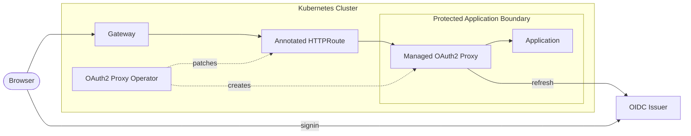

# OAuth2 Proxy Operator

OAuth2 Proxy Operator watches annotated Gateway API `HTTPRoute` resources and
places `oauth2-proxy` in front of protected application services. It keeps the
opt-in surface small: issuer, client ID, redirect URL, and optional client
secret reference. The MVP favors OIDC discovery, PKCE public clients, and no
project-local CRDs.

## System Diagram

