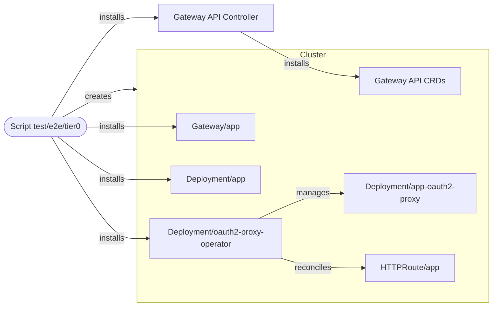

# Tier 0 E2E

Run with
`npm run test:e2e:tier0 --workspace @blakearoberts/oauth2-proxy-operator`.

This test validates the minimum operator control loop by asserting:

- annotated `HTTPRoute` is rewritten to direct traffic through oauth2-proxy,
- managed oauth2-proxy resources are created to service traffic through the
  annotated `HTTPRoute`,
- removing the `HTTPRoute` annotations restores the original routes and deletes
  the managed oauth2-proxy resources.

## System Block Diagram

