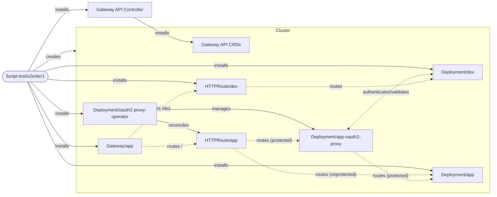

# Tier 1 E2E

Runs the local Gateway API and Dex authentication path in a fresh kind cluster.

Use `npm run test:e2e:tier1 --workspace @blakearoberts/oauth2-proxy-operator` to
verify that traffic enters through the Gateway, reaches Dex for login, returns
through oauth2-proxy, and reuses the session cookie on a second request.

## System Block Diagram

