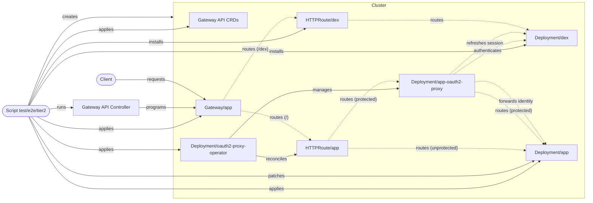

# Tier 2 E2E

Runs the local session lifecycle and upstream identity check in a fresh kind
cluster.

Use `npm run test:e2e:tier2 --workspace @blakearoberts/oauth2-proxy-operator` to
verify that an authenticated session refreshes without returning to Dex login,
keeps forwarding identity headers, and updates the upstream authorization token.

## System Block Diagram

