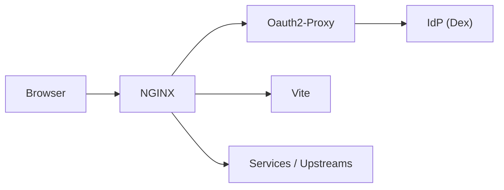

# Visage

Visage (`/vit·ɛdʒ/`) is a Vite plugin for local development with HMR and OIDC
session cookie lifecycle semantics.

## Getting Started

Install Visage from npm:

```console
npm install @blakearoberts/visage@next
```

Add the plugin to `vite.config.ts`:

```ts
import { defineConfig } from 'vite';
import visage from '@blakearoberts/visage';

export default defineConfig({
  plugins: [visage()],
});
```

Start Vite normally:

```console
vite
```

By default, you can reach the app at `https://localhost:9001`. You will be
redirected to Dex to sign in. The default username and password is
`user@example.com` and `pass`.

## Why Visage

Visage is a local development harness for web apps that run behind an
auth-protected edge, where browser sessions are represented by secure cookies
backed by OIDC tokens.

Visage narrows the gap between local development, automated tests, and
production by bringing production-like session lifecycle semantics to local Vite
development without giving up HMR. That makes it practical to iterate on SSR
identity injection, session timeout recovery, lock screens, and authenticated
API calls.

Visage can also use a hosted IdP, so local frontend code can call hosted backend
APIs with real credentials. That avoids frontend-only auth mocks or backend-only
local bypasses: code can be written for production and still work locally.

## Configuration

Visage is configured through `visage(options?)` in `vite.config.ts`.

The top-level `host` and `port` configure the local Visage origin that the
browser visits:

```ts
visage({ host: 'localhost', port: 9001 });
```

### Services

Services are Docker Compose services managed by the Vite dev-server lifecycle.
Additional services automatically get a matching managed upstream with the same
name, host, and default `/{name}/` location.

```ts
visage({
  services: { whoami: { image: 'traefik/whoami' } },
});
```

### Upstreams

Upstreams are proxy targets that Visage routes to. A top-level upstream with no
matching service entry is treated as an external upstream.

```ts
visage({
  upstreams: {
    api: { host: 'api.local.test', locations: { '/api/': {} } },
  },
});
```

Authenticated upstream locations do not forward bearer tokens by default. Set
`auth.forward` to `true` to forward the default bearer token for the upstream
kind: external upstreams receive the OAuth access token, while local service
upstreams receive the OIDC ID token.

Hosted backend APIs that validate bearer auth should generally receive the
access token, provided the token is issued for that API's issuer, audience, and
scopes. Use `'access'` or `'id'` when you need to force a specific token kind.

```ts
visage({
  upstreams: {
    api: {
      locations: {
        '/api/': { auth: { forward: true } },
      },
    },
  },
});
```

OAuth2 Proxy identity values can also be mapped explicitly through headers such
as `$auth_user`, `$auth_email`, `$auth_groups`, and `$auth_preferred_username`.

Authenticated locations also get Fetch Metadata CSRF checks by default. The
built-in Vite root location uses `csrf: 'app'`, which allows same-origin
requests and top-level `GET` document navigations. Other authenticated upstream
locations use `csrf: 'api'`, which blocks same-site and cross-site browser
requests when modern Fetch Metadata headers are present. Set `csrf: 'app'` for
an upstream that serves browser pages, or `csrf: false` when the upstream
intentionally handles cross-site browser requests itself.

### External IdPs

External OIDC providers use issuer discovery by default:

```ts
visage({
  idp: { issuer: 'https://idp.example.test/oauth2/default' },
});
```

Configure `authorization`, `token`, or `jwks` only when the provider endpoints
must be rendered explicitly instead of discovered from the issuer. Configure
`end_session_endpoint` when the provider supports OIDC end-session redirects.

See [`VisageOptions`](src/types.ts) for the full option surface.

## System Block Diagram



## Required Tools

- [Docker](https://docs.docker.com/get-started/get-docker/) with Compose v2
  support through `docker compose`.
- [`mkcert`](https://github.com/FiloSottile/mkcert#installation) installed on
  `PATH`, or configured with `VISAGE_MKCERT=/path/to/mkcert`.

## Managed Docker Images

Visage pulls these as needed based on configuration:

| Service                                                      | Image                                                                                       | Pin                                   |
| ------------------------------------------------------------ | ------------------------------------------------------------------------------------------- | ------------------------------------- |
| [NGINX](https://nginx.org/)                                  | [`nginx`](https://hub.docker.com/_/nginx)                                                   | [manifest](docker-compose.images.yml) |
| [OAuth2 Proxy](https://oauth2-proxy.github.io/oauth2-proxy/) | [`quay.io/oauth2-proxy/oauth2-proxy`](https://quay.io/repository/oauth2-proxy/oauth2-proxy) | [manifest](docker-compose.images.yml) |
| [Dex](https://dexidp.io/)                                    | [`ghcr.io/dexidp/dex`](https://github.com/dexidp/dex/pkgs/container/dex)                    | [manifest](docker-compose.images.yml) |
| [Socat](https://www.dest-unreach.org/socat/)                 | [`alpine/socat`](https://hub.docker.com/r/alpine/socat)                                     | [manifest](docker-compose.images.yml) |

## Security Notes

Visage is local-development tooling. It starts local auth infrastructure,
terminates local HTTPS, and forwards authenticated identity or token material to
configured upstreams.

Please report suspected vulnerabilities through GitHub private vulnerability
reporting as described in [Security Policy](SECURITY.md).

Do not treat the managed Dex and OAuth2 Proxy defaults as production auth
infrastructure.

Visage's CSRF policy is an edge request-isolation guard for cookie-backed
locations. It is not a replacement for application-owned CSRF tokens where an
application accepts form posts or other browser-submitted mutations. CSP,
`frame-ancestors`, and other click-jacking controls remain application policy.

## Troubleshooting

- If startup fails immediately, confirm Docker is running and `docker compose`
  works.
- If NGINX cannot start, check whether the configured `port` is already in use.
- If the hostname cannot be resolved, Visage may need permission to update
  `/etc/hosts`.
- If the browser rejects the certificate, allow the local certificate authority
  prompt from `mkcert`; CI test runners should be configured to ignore local
  HTTPS errors.

## TO-DO

- [ ] Harden the default security posture by addressing the
      [security hardening backlog](docs/security-hardening.md).
- [ ] Support [runtime config reloads](docs/config-reload.md).
- [ ] Support [Dex connectors](https://dexidp.io/docs/connectors/).
- [ ] Support Dex on a distinct subdomain, such as `auth.localhost`.
- [ ] Support [HTTP mode without local TLS](docs/tls-http-mode.md).
